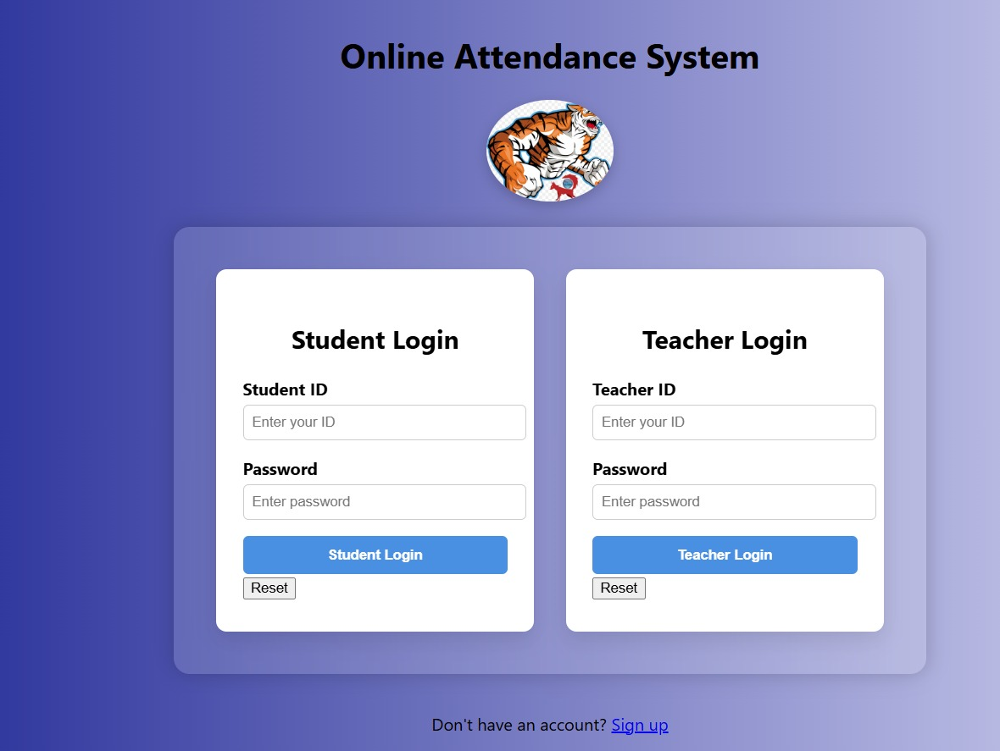
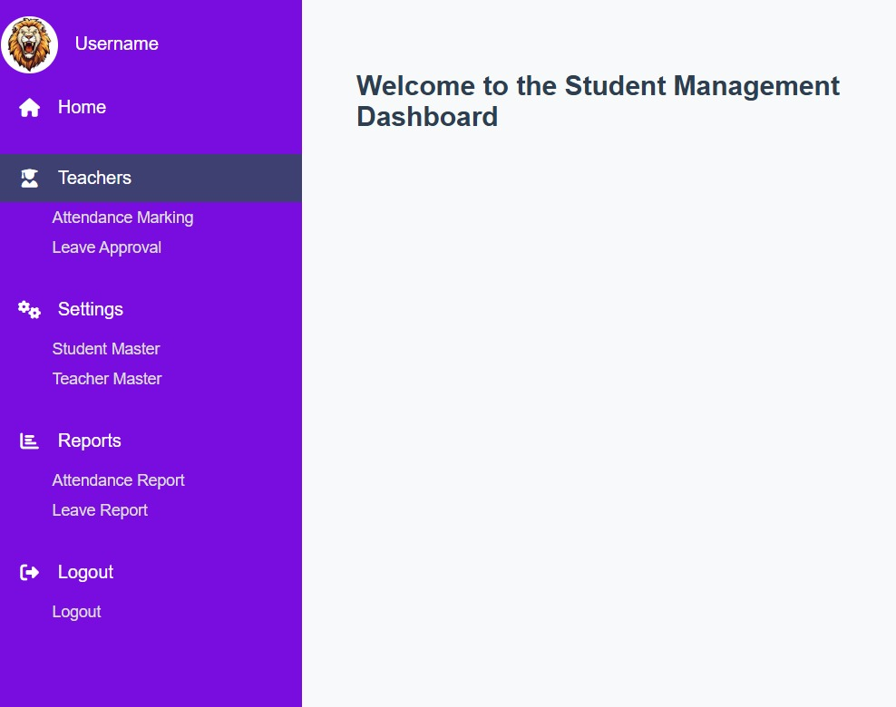
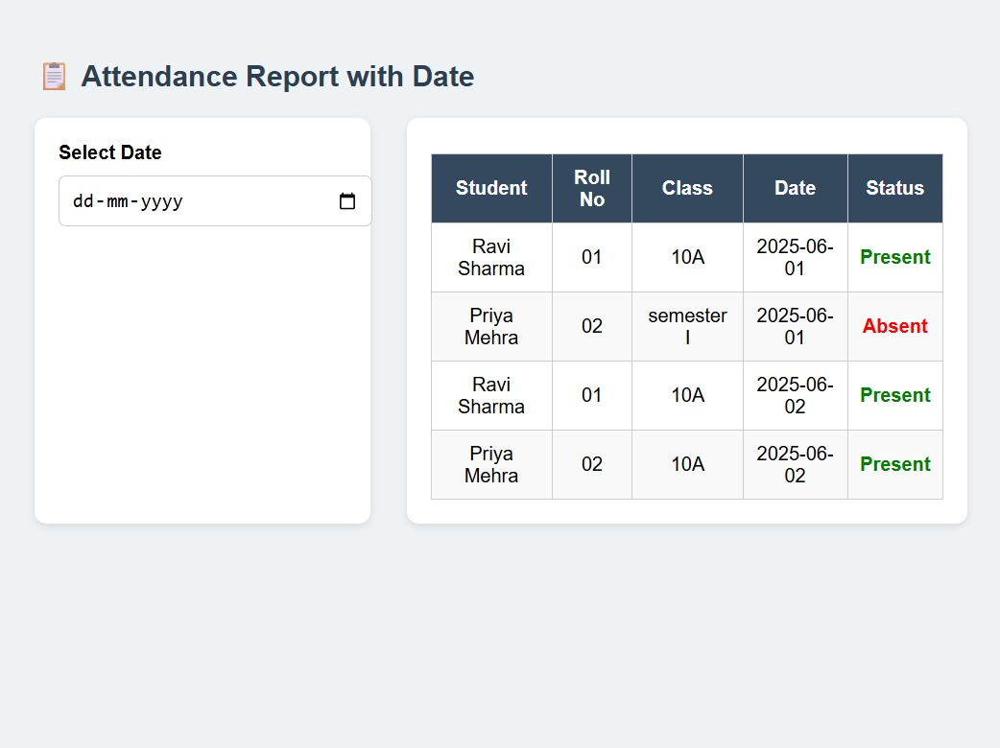

# 📚 Online Attendance Management System

An Online Attendance Management System developed using HTML, CSS, and JavaScript for managing student attendance, leave applications, teacher dashboards, and attendance reports.

---

# 🚀 Features

- Student Login & Signup
- Teacher Login
- Student Dashboard
- Teacher Dashboard
- Attendance Reports
- Leave Application System
- Responsive User Interface
- Attendance Record Management

---

# 🛠️ Technologies Used

- HTML5
- CSS3
- JavaScript

---

# 📂 Project Structure

```text
PROJECT/
│
├── css/
├── about.html
├── contact.html
├── home.html
├── login.html
├── sign up.html
├── student_dashboard.html
├── teacher_dashboard.html
├── report of attendance.html
└── report of leave.html
```

---

# 📸 Project Screenshots

## 🏠 Home Page


---

## 🔐 Login Page


---

## 👨‍🎓 Student Dashboard


---

## 👨‍🏫 Teacher Dashboard


---

## 📊 Attendance Report


---

# ⚙️ How to Run the Project

## Step 1
Download or clone the repository

```bash
git clone https://github.com/yourusername/attendance-management-system.git
```

---

## Step 2
Open the project folder in VS Code

---

## Step 3
Open `index.html` in browser

OR use Live Server extension in VS Code.

---

# 📌 Future Improvements

- Backend Integration
- Database Support
- Authentication System
- Admin Panel
- Real-time Attendance Tracking

---

# 👨‍💻 Developer

Hitesh Jain
